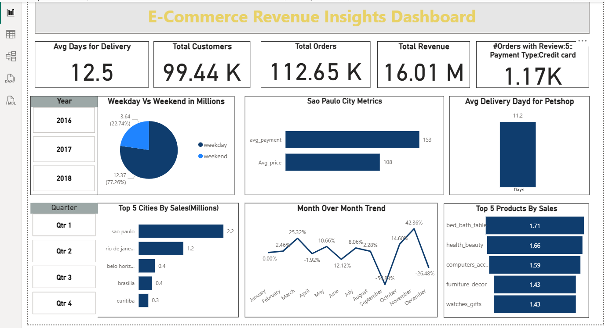

# 📌 Olist E-Commerce Analytics (Python + MySQL + Power BI)
I built this project as a complete end-to-end analytics solution using the Olist E-commerce dataset. I used Python to load and clean the data, stored everything in MySQL, and created SQL views for analysis. Then I connected those views to Power BI to build an interactive dashboard with KPIs, sales trends, and delivery insights. I also implemented city-based Row Level Security (RLS) so different users can only see data for their own city.

## 🚀 Features

Complete ETL pipeline using Python

MySQL database with optimized tables and SQL views

Analytical SQL queries for KPIs and business insights

Power BI interactive dashboard

City-based Row Level Security (RLS)

Clean, modular, and reusable project structure

## 📦 How to Run This Project
1. Clone the Repository
git clone https://github.com/your-username/olist-case-study.git

2. Load Data into MySQL

Run the Python ETL script:

python python/script_to_load.ipynb

3. Run SQL Scripts

Import tables, create indexes, and create views:

/sql/.sql

4. Open Power BI Dashboard

Load the .pbix file and update your MySQL connection.

## 📈 Results & Insights

Weekend are performing sales higher than that of weekday sales.

Sao Paulo and Rio de Janeiro generated the highest revenue.

Faster deliveries were linked to better review scores.

Pet shop products showed strong delivery performance.

Monthly revenue displayed clear seasonal trends.

Top product categories contributed most to overall sales.

City-based RLS allowed secure, location-specific dashboard access.

